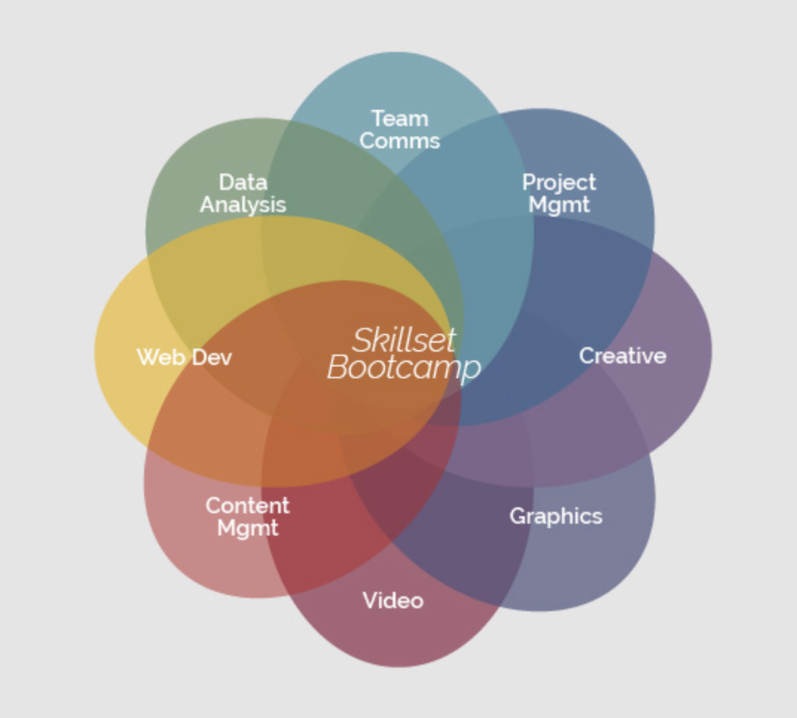

## knowledgebase

Step-by-step instruction on how to do the tasks described in the lectures and assignments of the skillset bootcamp.

Course 1: Team Comms  
Course 2: Project Mgmt  
Course 3: Creative  
Course 4: Graphics  
Course 5: Video  
Course 6: Content Mgmt  
Course 7: Web Dev  
Course 8: Data Analysis  

<!--  -->
